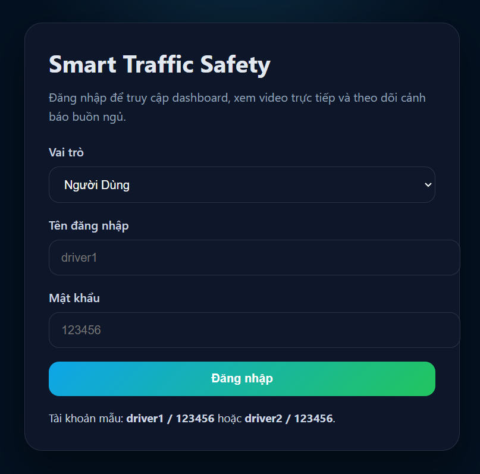
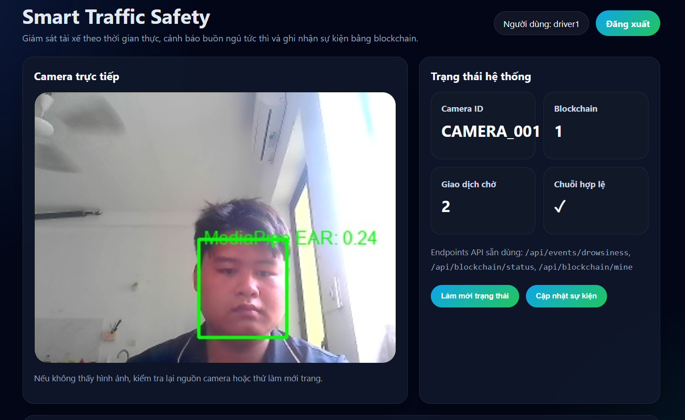
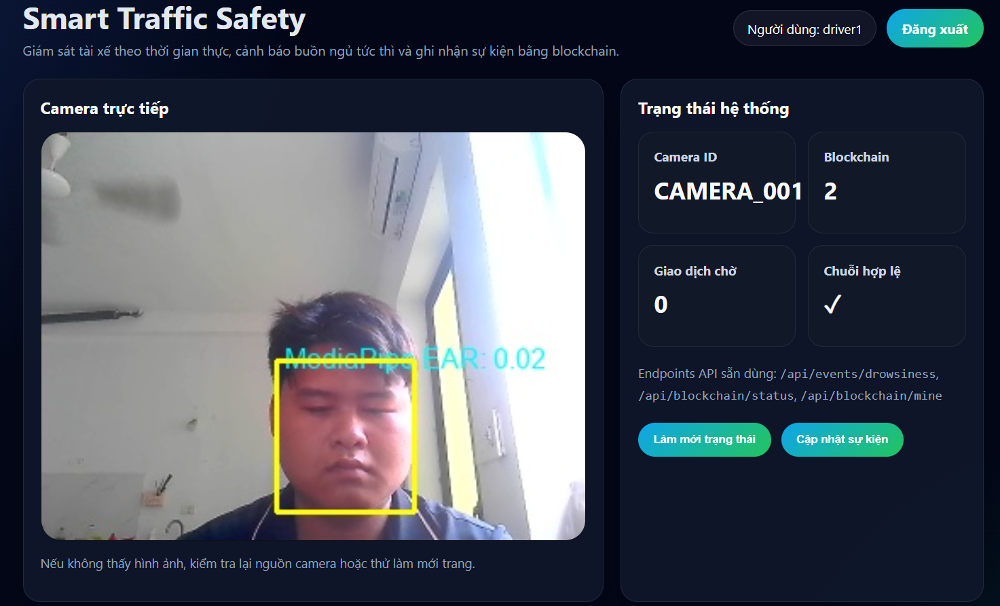
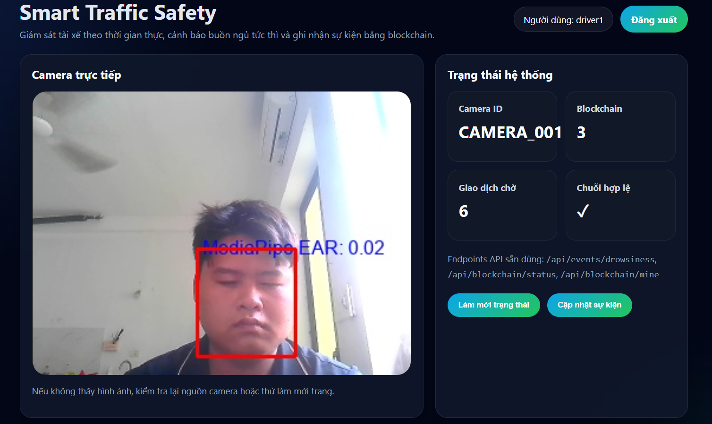

<h2 align="center">
    <a href="https://dainam.edu.vn/vi/khoa-cong-nghe-thong-tin">
    🎓 Faculty of Information Technology (DaiNam University)
    </a>
</h2>
<h2 align="center">
     HỆ THỐNG CẢNH BÁO BUỒN NGỦ KHI LÁI XE KẾT HỢP BLOCKCHAIN
</h2>

    

        
        
        
    

# 📖 1. Giới thiệu đề tài
## 🚗 Hệ thống cảnh báo buồn ngủ khi lái xe trong Thành phố thông minh

Trong quá trình phát triển Thành phố thông minh (Smart City), việc đảm bảo an toàn giao thông đóng vai trò vô cùng quan trọng. Theo nhiều thống kê, tình trạng tài xế buồn ngủ hoặc mất tập trung là một trong những nguyên nhân hàng đầu gây ra tai nạn giao thông nghiêm trọng.

Đề tài xây dựng hệ thống cảnh báo buồn ngủ khi lái xe sử dụng công nghệ Trí tuệ nhân tạo (AI), Internet vạn vật (IoT), Thị giác máy tính (Computer Vision) và Blockchain nhằm giám sát trạng thái người điều khiển phương tiện theo thời gian thực.

Hệ thống sử dụng camera để theo dõi khuôn mặt tài xế, phân tích trạng thái mắt và mức độ tập trung. Khi phát hiện dấu hiệu buồn ngủ hoặc mất tập trung, hệ thống sẽ phát cảnh báo tức thời, đồng thời lưu trữ dữ liệu sự kiện lên Blockchain nhằm đảm bảo tính minh bạch và toàn vẹn dữ liệu.

Đây là một giải pháp có khả năng ứng dụng trong giao thông thông minh, xe công nghệ, xe khách đường dài, xe tải vận chuyển hàng hóa và các phương tiện phục vụ đô thị thông minh.

# 🎯 2. Mục tiêu đề tài
Giám sát trạng thái người lái xe theo thời gian thực.
Phát hiện dấu hiệu buồn ngủ và mất tập trung.
Cảnh báo nguy cơ mất an toàn giao thông.
Lưu trữ hình ảnh bằng chứng.
Tạo mã băm SHA-256 đảm bảo tính toàn vẹn dữ liệu.
Lưu trữ lịch sử cảnh báo trên Blockchain.
Hỗ trợ xây dựng hệ thống giao thông thông minh trong Smart City.
# 🏙️ 3. Ý nghĩa đối với Thành phố thông minh
🚦 Smart Transportation
Giảm thiểu tai nạn giao thông.
Nâng cao an toàn cho người tham gia giao thông.
Hỗ trợ quản lý phương tiện thông minh.
📡 Smart IoT
Thu thập dữ liệu từ camera thời gian thực.
Truyền dữ liệu đến hệ thống giám sát.
Hỗ trợ giám sát từ xa.
🔒 Smart Data
Quản lý dữ liệu an toàn.
Đảm bảo tính toàn vẹn dữ liệu.
Hỗ trợ truy xuất lịch sử cảnh báo.
⛓️ Blockchain
Chống chỉnh sửa dữ liệu.
Lưu vết các sự kiện cảnh báo.
Tăng tính minh bạch trong quản lý giao thông.
# 🌱 4. Liên hệ với Nông nghiệp thông minh

Ngoài ứng dụng trong giao thông thông minh, hệ thống còn có thể áp dụng trong lĩnh vực Nông nghiệp thông minh:

Giám sát người vận hành máy cày.
Giám sát người điều khiển máy gặt.
Phát hiện trạng thái mệt mỏi của công nhân nông nghiệp.
Giảm nguy cơ tai nạn lao động.
Lưu lịch sử vận hành thiết bị nông nghiệp trên Blockchain.
# 🏗️ 5. Kiến trúc hệ thống
📷 Camera Monitoring Module

Chức năng:

Thu nhận hình ảnh khuôn mặt tài xế.
Truyền dữ liệu video tới hệ thống AI.
🤖 AI Processing Module

Chức năng:

Phát hiện khuôn mặt.
Xác định vị trí mắt.
Tính toán Eye Aspect Ratio (EAR).
Phát hiện trạng thái buồn ngủ.
Phát hiện mất tập trung.
Kích hoạt cảnh báo.
🔊 Alert Module

Chức năng:

Phát âm thanh cảnh báo.
Hiển thị cảnh báo trên giao diện web.
📸 Evidence Module

Chức năng:

Chụp ảnh bằng chứng.
Lưu thời gian xảy ra sự kiện.
Hỗ trợ truy xuất dữ liệu.
⛓️ Blockchain Module

Chức năng:

Sinh mã SHA-256.
Kết nối Ethereum Blockchain.
Ghi dữ liệu lên Smart Contract.
Kiểm tra tính toàn vẹn dữ liệu.
🌐 Web Dashboard

Chức năng:

Hiển thị video thời gian thực.
Hiển thị trạng thái tài xế.
Kết nối MetaMask.
Theo dõi lịch sử cảnh báo.
Lưu dữ liệu Blockchain.
# 🚀 6. Chức năng chính
👁️ Theo dõi trạng thái người lái
Nhận diện khuôn mặt.
Theo dõi mắt.
Tính toán chỉ số EAR.
⚠️ Phát hiện buồn ngủ
Phát hiện mắt nhắm liên tục.
Đánh giá mức độ nguy hiểm.
Kích hoạt cảnh báo.
🚨 Cảnh báo thời gian thực
Phát âm thanh.
Hiển thị thông báo trên giao diện.
📸 Lưu ảnh bằng chứng
Chụp ảnh người lái.
Lưu thời gian phát hiện.
🔐 Tạo mã SHA-256
Mã hóa dữ liệu sự kiện.
Kiểm tra tính toàn vẹn dữ liệu.
⛓️ Lưu dữ liệu Blockchain
Kết nối MetaMask.
Ký giao dịch.
Ghi dữ liệu lên Smart Contract.
# 🛠️ 7. Công nghệ sử dụng
Công nghệ	Vai trò
Python	Ngôn ngữ lập trình chính
Flask	Web Server
OpenCV	Xử lý ảnh
MediaPipe	Nhận diện khuôn mặt
TensorFlow/Keras	AI phát hiện buồn ngủ
Ethereum Blockchain	Lưu trữ dữ liệu
Solidity	Smart Contract
MetaMask	Ký giao dịch
Web3.py	Tương tác Blockchain
SHA-256	Kiểm tra toàn vẹn dữ liệu
HTML/CSS/JS	Giao diện Web
# 📂 8. Cấu trúc dự án
project/
│
├── templates/
├── static/
├── models/
├── captured_images/
├── blockchain.py
├── deploy_contract.py
├── DrowsinessDetection.sol
├── testAmThanh.py
├── requirements.txt
├── .env
└── README.md
# 🚀 9. Hướng dẫn cài đặt
Bước 1. Tạo môi trường ảo
python -m venv .venv
Bước 2. Kích hoạt môi trường
.venv\Scripts\Activate.ps1
Bước 3. Cài đặt thư viện
pip install -r requirements.txt
Bước 4. Cấu hình Blockchain
INFURA_URL=your_infura_url
CONTRACT_ADDRESS=your_contract_address
Bước 5. Chạy hệ thống
python testAmThanh.py
Bước 6. Truy cập giao diện
http://127.0.0.1:5000
# ⛓️ 10. Triển khai Smart Contract
Mở Remix IDE.
Compile file DrowsinessDetection.sol.
Chọn Injected Provider - MetaMask.
Kết nối mạng Sepolia Testnet.
Deploy Smart Contract.
Sao chép Contract Address.
Cập nhật vào file .env.
# 📷 11. Hình ảnh hệ thống
### Hình 1. Giao diện đăng nhập

=======

### Hình 2. Mắt mở bình thường

### Hình 3. Mắt mở bất thường

### Hình 4. Phát hiện buồn ngủ & mất tập trung 

# 📊 12. Kết quả đạt được
Phát hiện trạng thái buồn ngủ theo thời gian thực.
Giám sát người lái xe liên tục.
Cảnh báo bằng âm thanh.
Lưu ảnh bằng chứng.
Tạo mã băm SHA-256.
Kết nối thành công MetaMask.
Lưu dữ liệu lên Ethereum Sepolia.
Đảm bảo tính toàn vẹn dữ liệu.
Phù hợp với định hướng Smart City và Smart Transportation.
# 🔮 13. Hướng phát triển
Triển khai trên Raspberry Pi hoặc Jetson Nano.
Tích hợp GPS theo dõi vị trí phương tiện.
Kết nối hệ thống điều hành giao thông thông minh.
Xây dựng ứng dụng di động.
Tích hợp camera hồng ngoại hoạt động ban đêm.
Ứng dụng trên xe khách, xe tải và phương tiện công cộng.
# 👨‍🎓 14. Thông tin sinh viên
Họ và tên: Lê Hải Đăng
Lớp: CNTT 16-04
MSSV: 1671020084
Trường: Đại học Đại Nam
Khoa: Công nghệ Thông tin
Học phần: Thành phố thông minh và Nông nghiệp thông minh

## © 2026 Faculty of Information Technology - Dai Nam University